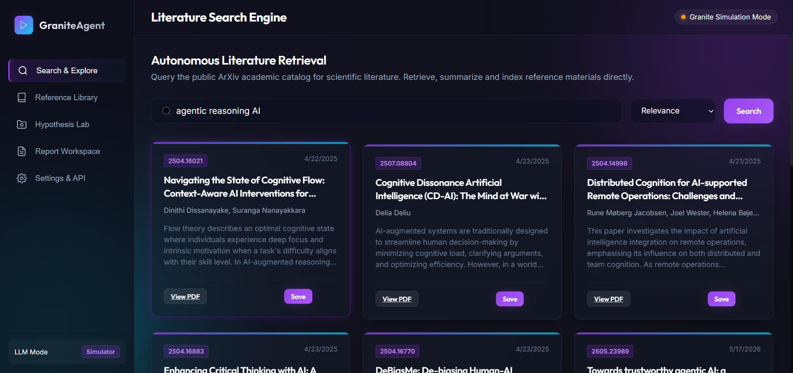

# GraniteAgent: AI Research Assistant

An AI-powered research workspace that helps you search academic literature, save references, generate research hypotheses and draft report sections, powered by **IBM Granite** models on watsonx.ai.

**Live demo:** https://research-agent-w0mg.onrender.com/

> The demo runs on a free Render instance, so the first load after a period of inactivity can take 30 to 60 seconds while the server wakes up.

Built as part of the IBM SkillsBuild internship.



## Features

- **Literature Search:** query the public arXiv catalog with sorting options (relevance, date) and get titles, authors, abstracts and direct PDF links.
- **Reference Library:** save papers you find and keep them together in one place.
- **Hypothesis Lab:** generate structured research hypotheses with rationale, experiment protocol and key variables.
- **Report Workspace:** draft report sections such as literature reviews using the saved references.
- **Paper Summaries:** summarize abstracts into objective, method, findings and limitations.
- **Two LLM modes:**
  - **Simulator (default):** works out of the box with demo responses, no credentials needed.
  - **Live Granite:** add your IBM watsonx.ai API key and project ID in **Settings & API** to get real completions from `ibm/granite-3-8b-instruct`.
- **Offline-friendly search:** if the arXiv API is rate-limited or unreachable, the server falls back to a small built-in paper catalog so the app keeps working.

## Tech Stack

| Layer | Technology |
|---|---|
| Frontend | React 19, Vite |
| Backend | Node.js, Express 5 |
| AI | IBM watsonx.ai (Granite 3 8B Instruct) |
| Data source | arXiv API |
| Hosting | Render |

## How It Works

```
Browser (React)
   |  /api/search            -> Express -> arXiv API (XML parsed to JSON)
   |  /api/llm/generate      -> Express -> IBM Cloud IAM token -> watsonx.ai text chat
   v
Simulator mode (no credentials) returns demo responses
```

In production, Express serves the built React app (`dist/`) and the API from a single service, so no CORS setup or separate frontend hosting is needed.

### API Endpoints

| Method | Route | Description |
|---|---|---|
| `GET` | `/api/search` | Search arXiv. Query params: `q`, `start`, `maxResults`, `sortBy`, `sortOrder` |
| `POST` | `/api/llm/generate` | Generate text with Granite. Body: `messages`, `promptType`, `customPrompt` |

IBM credentials are sent per request from the browser through the `x-ibm-apikey`, `x-ibm-projectid`, `x-ibm-region` and `x-ibm-modelid` headers. They are not stored on the server.

## Run Locally

**Requirements:** Node.js 20 or newer.

```bash
git clone https://github.com/siddharthpatwal26/GraniteAgent.git
cd Research-Agent-
npm install
```

**Development** (two terminals):

```bash
node server.js     # backend on http://localhost:5000
npm run dev        # frontend on http://localhost:5173 (proxies /api to the backend)
```

**Production build** (single server):

```bash
npm run build
npm start          # everything on http://localhost:5000
```

## Deploy on Render

1. Push the repo to GitHub.
2. On Render, create a **New Web Service** and select the repository.
3. Build command: `npm install --include=dev && npm run build`
4. Start command: `npm start`
5. No environment variables are required.

## Using Live Granite

1. Create a watsonx.ai project on IBM Cloud and note the **project ID**.
2. Create an IBM Cloud **API key**.
3. Open **Settings & API** in the app and enter the key, project ID and region.
4. The header badge switches from Simulation Mode to live mode.

Never commit API keys to the repository.

## Project Structure

```
.
├── server.js          # Express API + static file server
├── src/               # React application
├── public/            # Static assets
├── index.html         # Vite entry
├── vite.config.js     # Vite config with dev proxy for /api
└── package.json
```

## Roadmap

- Server-side credentials option for a hosted live Granite mode
- Export reports to PDF and Word
- Citation formatting (APA, IEEE)
- Persistent reference library with user accounts

## Author

**Siddharth**
GitHub: [@siddharthpatwal26](https://github.com/siddharthpatwal26)
